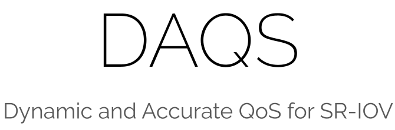

<br/>
<p align="center">
  <a href="https://github.com/Brian-Hwang/DAQS">
    
  </a>

  <p align="center">
    <a href="https://ictc.org/media?key=site/ictc2023a/abs/P4-20.pdf">Publication</a>
    .
    <a href="https://github.com/Brian-Hwang/DAQS">Explore the docs</a>
    .
    <a href="https://github.com/Brian-Hwang/DAQS/issues">Report Bug</a>
    .
    <a href="https://github.com/Brian-Hwang/DAQS/issues">Request Feature</a>
  </p>
</p>

## Table Of Contents

- [Table Of Contents](#table-of-contents)
- [About The Project](#about-the-project)
- [Prerequisites](#prerequisites)
- [Usage](#usage)
- [Detailed Description of Models](#detailed description of models)
- [TODO](#todo)

## About The Project

<p align="center">
  
</p>
Single Root Input/Output Virtualization(SR-IOV) is a key feature in the PCI Express(PCIe) specifications, which facilitates the shared use of the same device in a virtualized environment by different virtual machines(VMs) and enables network traffic to bypass the usual virtualization stack, reducing interference among Virtual Functions(VFs). However, guaranteeing Quality of Service(QoS) as mandated by Service Level Agreements(SLAs) in these environments is challenging due to the host stack bypassing. This paper discusses these challenges and proposes an approach to ensure accurate QoS in SR-IOV environments by monitoring and regulating traffic from the host side through QEMU Guest Agent. The proposed approach automatically manages active VFs to meet SLA while fully utilizing the host bandwidth.

## Results

<p align="center">
  
</p>
<p align="center">
  <em>Fig. 1. Utilization of Guarantee VM, Best-Effort VM, and total bandwidth</em>
</p>

> As shown in Fig. 1, The throughput of the Guarantee VM is compromised at the baseline (Leftmost bar). For the 10Gbps and 15Gbps guarantee cases, ip link can successfully guarantee 10Gbps but not 15Gbps, while DAQS can guarantee both
> well. For ip link to guarantee a 15Gbps on the guarantee
> VM, we can see that it requires down to a 10Gbps limit on
> the Best-effort VM, resulting in 65.9% of the total bandwidth
> utilization.

<p align="center">
  
</p>
<p align="center">
  <em>Fig. 2. Adaptability in multi-tenant environment</em>
</p>

> Fig. 2 shows the achieved throughput of the baseline, ip
> link, and DAQS under the above experiment scenario. Here
> we can see that turning on a VM has no impact if it is not
> generating traffic. Even when other processes start generating
> traffic, the Guarantee VM’s throughput is still guaranteed
> with DAQS regardless of the number of bandwidth-consuming
> processes, and the overall bandwidth is 93% of the baseline
> similar to what we observed in the prior experiment.

### Prerequisites

> Ensure your system meets the following prerequisites for using DAQS. It is designed for LINUX systems that use virtual machines through KVM/Qemu.

1. **Setup SR-IOV (Single Root Input/Output Virtualization):**

   - **Hardware Compatibility:** Confirm that your hardware supports SR-IOV.
   - **Enable SR-IOV in BIOS:** Enable SR-IOV in your system's BIOS.
   - **Install Necessary Drivers:** Install and update SR-IOV supporting drivers.
   - **Configure SR-IOV:** Adjust SR-IOV settings to allocate resources for virtual functions.

2. **Setup KVM (Kernel-based Virtual Machine):**

   - **Install KVM:** Install KVM on your Linux system.
   - **Verify KVM Installation:** Check KVM installation and CPU virtualization support.
   - **Configure KVM:** Set up KVM for creating and managing virtual machines.

3. **Setup Qemu Guest Agent:**
   - **At Host:**
     - Modify the guest VM configuration: Use `sudo virsh edit <guest_name>` to edit the VM configuration.
     - Add the following XML snippet to the configuration file:
       ```xml
       <channel type='unix'>
         <target type='virtio' name='org.qemu.guest_agent.0'/>
         <address type='virtio-serial' controller='0' bus='0' port='2'/>
       </channel>
       ```
   - **At Guest:**
     - Install Qemu Guest Agent: Run `sudo apt-get install qemu-guest-agent` on the guest system.
     - Enable the Guest Agent: Enable the service with `sudo systemctl enable qemu-guest-agent`.
     - Start the Guest Agent: Start the service using `sudo systemctl start qemu-guest-agent`.

These steps provide a general guideline for setting up DAQS on Linux systems with KVM/Qemu. Specific instructions may vary based on your Linux distribution and system configuration. Consult your system's documentation or support resources for detailed instructions tailored to your setup.

## Usage

1. **Clone the Repository:**

   ```sh
   git clone https://github.com/Brian-Hwang/DAQS.git
   ```

2. **Configure Settings:**

   - **`/config/defaults.ini`:**
     ```ini
     [DEFAULT]
     host_interface = ens6f1np1
     default_payment = 100
     host_base_directory = /home/brian11hwang/SR-IOV/GA-VM/GA_VM_QOS
     guest_base_directory= /home/user
     ```
   - **`/config/min_bw.ini`:** (Add multiple VMs to demonstrate variability)
     ```ini
     [DEFAULT]
     b1_vm1 = 15
     b1_vm2 = 10
     b1_vm3 = 20
     b2_vm1 = 25
     ```
   - **`/config/payments.ini`:** (Include a variety of VMs and payment values)
     ```ini
     [DEFAULT]
     ubuntu_20.04-clone1 = 400
     ubuntu_20.04-clone2 = 300
     ubuntu20.04-clone3 = 200
     ubuntu20.04-clone4 = 100
     b1_vm1 = 150
     b1_vm2 = 100
     b2_vm1 = 50
     ```

3. **Run the Models:**
   To execute a model, use the following command structure:
   ```sh
   python3 models/[model_type]/[model_name].py
   ```
   Replace `[model_type]` and `[model_name]`with the desired model, such as `fairshare`, `minimum_guarantee`, or `weighted_share`.

### Detailed Description of Models

- **Standalone Model:**

  - Limits the bandwidth of a single VM. Configure the VM and bandwidth limit in the relevant configuration file.

- **Multi-Tenants Model:**
  - **Fairshare:** Distributes bandwidth equally among all VMs. Useful when you want to ensure equal resource allocation.
  - **Minimum Guarantee:** Reserves a minimum bandwidth for specified VMs (configured in `min_bw.ini`). The remaining bandwidth is distributed among other VMs.
  - **Weighted Share:** Allocates bandwidth based on the payment values set in `payments.ini`. Higher payments lead to higher bandwidth allocation.

Ensure to execute the models from the root directory of the cloned repository and check that all prerequisites and configurations are correctly set up before running the models.

## TODO

1. Add support for other VMs ( Hyper-V Integration Services / VMwaare Tools / etc)
2. Add driver support to bypass Qemu Guest Agent
