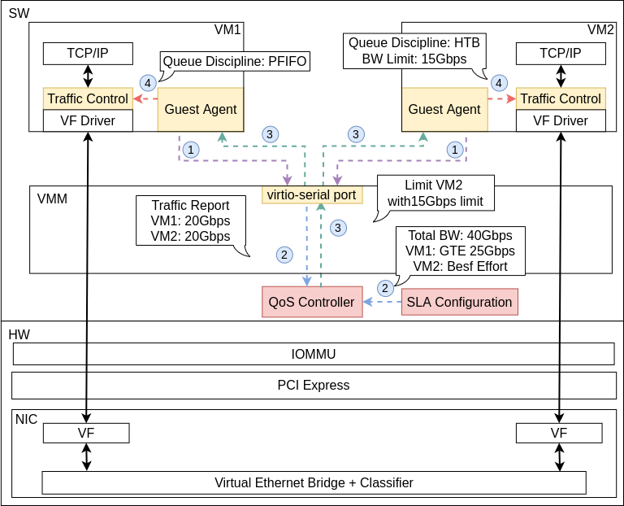
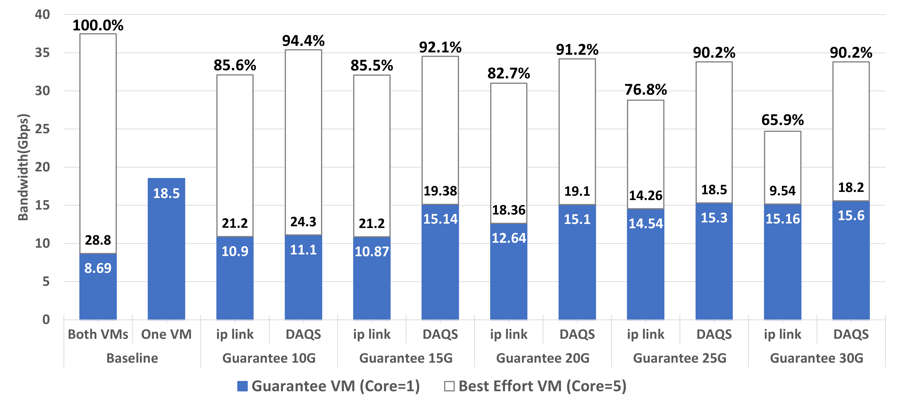
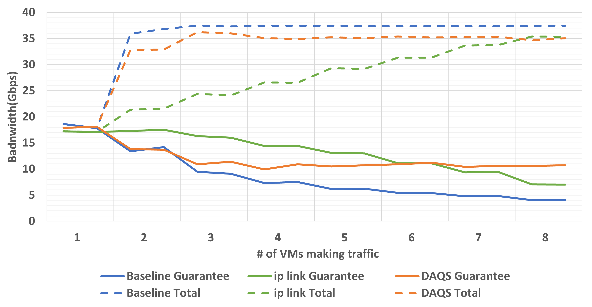

<br/>
<p align="center">
  <a href="https://github.com/Brian-Hwang/DAQS">
    
  </a>

  <h3 align="center">DAQS</h3>

  <p align="center">
    Dynamic and Accurate QoS for SR-IOV
    <br/>
    Enhancing Quality of Service in Virtual Machine Systems
    <br/>
    <br/>
    <a href="https://daqsdemo.example.com"><strong>View Demo »</strong></a>
    <br/>
    <br/>
    <a href="https://github.com/Brian-Hwang/DAQS">Explore the docs</a>
    .
    <a href="https://github.com/Brian-Hwang/DAQS/issues">Report Bug</a>
    .
    <a href="https://github.com/Brian-Hwang/DAQS/issues">Request Feature</a>
  </p>
</p>

   

## Table Of Contents

- [Table Of Contents](#table-of-contents)
- [About The Project](#about-the-project)
- [Getting Started](#getting-started)
  - [Prerequisites](#prerequisites)
  - [Installation](#installation)
- [Usage](#usage)

## About The Project

<p align="center">
  
</p>
Single Root Input/Output Virtualization(SR-IOV) is a key feature in the PCI Express(PCIe) specifications, which facilitates the shared use of the same device in a virtualized environment by different virtual machines(VMs) and enables network traffic to bypass the usual virtualization stack, reducing interference among Virtual Functions(VFs). However, guaranteeing Quality of Service(QoS) as mandated by Service Level Agreements(SLAs) in these environments is challenging due to the host stack bypassing. This paper discusses these challenges and proposes an approach to ensure accurate QoS in SR-IOV environments by monitoring and regulating traffic from the host side through QEMU Guest Agent. The proposed approach automatically manages active VFs to meet SLA while fully utilizing the host bandwidth.

## Results

<p align="center">
  
</p>
<p align="center">
  <em>Fig. 1. Utilization of Guarantee VM, Best-Effort VM, and total bandwidth</em>
</p>

> As shown in Fig. 1, The throughput of the Guarantee VM is compromised at the baseline (Leftmost bar). For the 10Gbps and 15Gbps guarantee cases, ip link can successfully guarantee 10Gbps but not 15Gbps, while DAQS can guarantee both
> well. For ip link to guarantee a 15Gbps on the guarantee
> VM, we can see that it requires down to a 10Gbps limit on
> the Best-effort VM, resulting in 65.9% of the total bandwidth
> utilization.

<p align="center">
  
</p>
<p align="center">
  <em>Fig. 2. Adaptability in multi-tenant environment</em>
</p>

> Fig. 2 shows the achieved throughput of the baseline, ip
> link, and DAQS under the above experiment scenario. Here
> we can see that turning on a VM has no impact if it is not
> generating traffic. Even when other processes start generating
> traffic, the Guarantee VM’s throughput is still guaranteed
> with DAQS regardless of the number of bandwidth-consuming
> processes, and the overall bandwidth is 93% of the baseline
> similar to what we observed in the prior experiment.

## Getting Started

### Prerequisites

- List of software and hardware prerequisites.

### Installation

1. Clone the repo

```sh
git clone https://github.com/Brian-Hwang/DAQS.git
```

2. Follow installation instructions

## Usage

Detailed usage instructions will be provided here.
